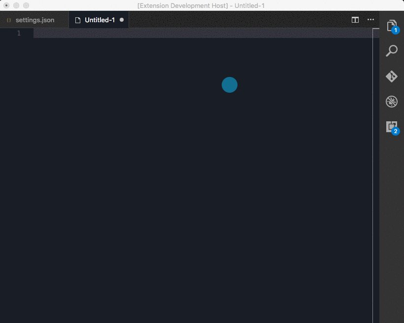

# What is it?

Creates an animated trail for changes made to the text document.

> It is mostly pointless, but, kinda fun. Maybe.

# Install

* Install via VSCode extensions install.

# Usage

* Ensure it is enabled and then just type.

# Example

# Enable/Disable

You can enable/disable the plugin using the command:

* SnakeTrail.Enable
* SnakeTrail.Disable

If you want to re-read any configuration changes, disable then enable.

# Configuration

* You can modify the snake trail color (default / light / dark)
    * `"snakeTrail.color": "0,255,0"`
    * `"snakeTrail.colorLight": "0,255,0"`
    * `"snakeTrail.colorDark": "0,255,0"`
* You can modify the snake trail fade rate
    * `"snakeTrail.fadeMS": 100`

# _Open Source_

If you like but want to make changes/improvemnents, please submit PRs rather than forking.